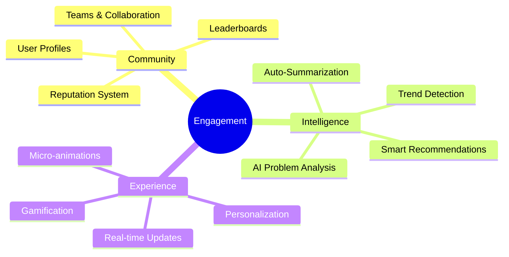
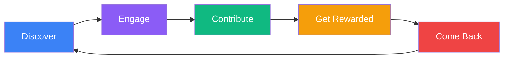
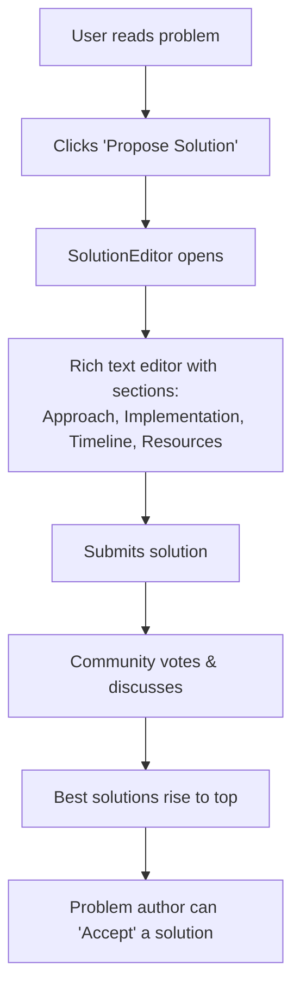
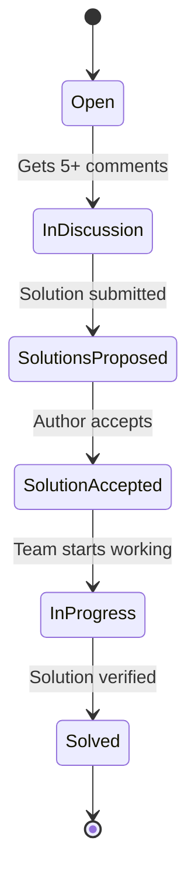
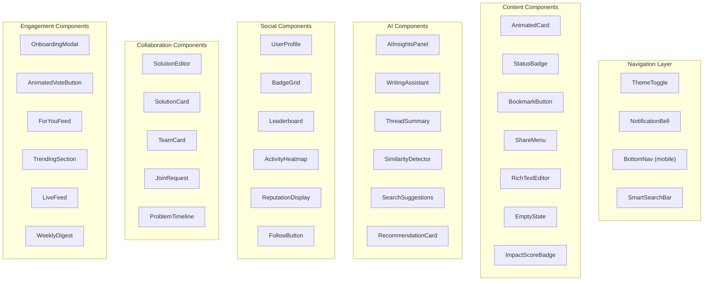

# SolvingHub — Engagement Enhancement Report

> Making SolvingHub the most engaging open innovation platform through new features, AI integration, and premium UI/UX.

---

## Table of Contents

1. [Engagement Strategy Overview](#1-engagement-strategy-overview)
2. [New Components & Features](#2-new-components--features)
3. [AI Integration Strategy](#3-ai-integration-strategy)
4. [UI/UX Enhancements](#4-uiux-enhancements)
5. [Gamification System](#5-gamification-system)
6. [Component Architecture Map](#6-component-architecture-map)
7. [Implementation Priority Matrix](#7-implementation-priority-matrix)

---

## 1. Engagement Strategy Overview

SolvingHub currently has a strong foundation for problem discovery and discussion. To make it truly engaging, we need to focus on three pillars:



### The Engagement Loop



---

## 2. New Components & Features

### 2.1 — `<UserProfile />` — User Profile Page

**Route**: `/profile/[uid]`

| Element | Description |
|---|---|
| Profile header | Avatar, display name, bio, join date, location |
| Stats row | Problems posted, comments made, votes given, reputation score |
| Contribution graph | GitHub-style activity heatmap showing daily contributions |
| Tab: My Problems | All submitted problems |
| Tab: My Solutions | Solutions they've proposed |
| Tab: Bookmarks | Saved/bookmarked problems |
| Settings gear | Edit bio, notification prefs, theme preference |

**Why it matters**: Users need identity. No one engages deeply with a platform where they're anonymous. Profiles create investment and social proof.

---

### 2.2 — `<SolutionProposal />` — Proposed Solutions System

**Route**: Integrated into `/problems/[id]` under the "Proposed Solutions" tab



**Components needed**:
- `<SolutionEditor />` — Rich form with markdown support
- `<SolutionCard />` — Card showing solution preview, author, votes
- `<SolutionDetail />` — Full solution view with discussion sub-thread
- `<SolutionVoting />` — Upvote/downvote with separate count from problem votes

**Firestore collection**: `solutions`
```
{
  id, problemId, authorId, authorName, authorPhotoURL,
  approach, implementation, timeline, resources,
  votes, status: "proposed" | "accepted" | "in-progress",
  timestamp
}
```

---

### 2.3 — `<BookmarkButton />` — Save Problems for Later

A simple heart/bookmark icon on every problem card and detail page.

**Firestore collection**: `bookmarks`
```
{ userId, problemId, timestamp }
```

**Components**:
- `<BookmarkButton />` — Toggle bookmark with optimistic UI + animation
- `<BookmarksPage />` — Route `/bookmarks` showing all saved problems

**Why it matters**: Bookmarking is one of the highest-signal engagement actions. If a user bookmarks, they'll return.

---

### 2.4 — `<NotificationCenter />` — Real-time Notifications

**Component**: Dropdown panel accessible from navbar bell icon

**Notification triggers**:
- Someone comments on your problem
- Someone replies to your comment
- Your problem gets 10/50/100 votes
- A new problem is posted in a category you follow
- Your solution gets accepted

**Components**:
- `<NotificationBell />` — Navbar icon with unread count badge
- `<NotificationPanel />` — Dropdown with notification list
- `<NotificationItem />` — Individual notification row
- `<NotificationPreferences />` — Settings page for notification control

**Tech**: Use Firestore `onSnapshot` for real-time delivery, or consider Firebase Cloud Messaging for push notifications.

---

### 2.5 — `<TrendingSection />` — Trending & Live Activity Feed

**Route**: `/trending` or integrated into homepage

**Components**:
- `<TrendingProblems />` — Problems gaining votes fastest (last 24h/7d)
- `<LiveFeed />` — Real-time scrolling feed of activities
- `<WeeklyDigest />` — Curated top problems of the week
- `<CategoryTrends />` — Which categories are heating up

```
┌─────────────────────────────────────────┐
│ 🔥 Trending Now                         │
│                                         │
│ ↑ 47 votes  "Clean water access in..."  │
│ ↑ 32 votes  "AI bias in hiring..."      │
│ ↑ 28 votes  "Food waste tracking..."    │
│                                         │
│ 📊 Live Activity                        │
│ • Rohit posted a new problem — 2m ago   │
│ • Priya solved "Urban transport" — 5m   │
│ • 15 new votes in Education — 1h ago    │
└─────────────────────────────────────────┘
```

---

### 2.6 — `<CollaborationHub />` — Team Formation

**Route**: `/teams`

Allow users to form teams around specific problems:
- `<TeamCreation />` — Create a team for a problem
- `<TeamCard />` — Shows team name, members, problem they're solving
- `<JoinRequest />` — Request to join a team
- `<TeamChat />` — Simple messaging within teams (can use Firestore subcollections)

---

### 2.7 — `<ProblemTimeline />` — Problem Status Tracking

Add a lifecycle to problems:



**Component**: `<StatusBadge />` — Colored badge showing current lifecycle stage on every problem card.

---

### 2.8 — `<RelatedProblems />` — Problem Relationships

On `ProblemDetail`, show:
- "Similar Problems" — based on tags and category overlap
- "Related by the same author"
- "Problems you might like" — based on user's voting/bookmarking history

---

## 3. AI Integration Strategy

### 3.1 — `<AIAnalysis />` — Automated Problem Analysis

When a problem is posted, an AI (via OpenAI/Gemini API) automatically generates:

| Analysis Section | Description |
|---|---|
| **Root Cause Analysis** | AI identifies potential root causes |
| **Stakeholder Map** | Who is affected, who can solve it |
| **Similar Existing Solutions** | Web search for what's been tried globally |
| **Impact Score** | AI-estimated severity (1-10) across social, economic, environmental axes |
| **Suggested Tags** | Auto-generated tags based on content |
| **Readability Score** | How well the problem is described |

**Component**: `<AIInsightsPanel />` — Collapsible section on ProblemDetail page

```
┌──────────────────────────────────────────┐
│ 🤖 AI Analysis                    [Auto] │
│                                          │
│ Impact Score: 8.2/10                     │
│ ■■■■■■■■□□ Social                        │
│ ■■■■■■□□□□ Economic                      │
│ ■■■■■■■■■□ Environmental                 │
│                                          │
│ Root Causes Identified:                  │
│ 1. Lack of infrastructure in rural areas │
│ 2. Policy gaps in waste management       │
│ 3. Low public awareness                  │
│                                          │
│ Similar initiatives worldwide:           │
│ • SwachBharat (India) — 60% success rate │
│ • TerraCycle (USA) — Private sector model│
│                                          │
│ Suggested Tags: #waste #rural #policy    │
└──────────────────────────────────────────┘
```

---

### 3.2 — `<SmartSearch />` — AI-Powered Semantic Search

Replace the current client-side string matching with:
- **Semantic search**: "problems about hungry kids" matches "childhood malnutrition in schools"
- **Natural language queries**: "What are the biggest environmental challenges in India?"
- **Auto-suggestions**: Typeahead with AI-powered completions

**Implementation**: Use OpenAI Embeddings + vector similarity search (Pinecone/Supabase pgvector), or Algolia with AI synonyms.

**Components**:
- `<SmartSearchBar />` — Enhanced search with suggestions dropdown
- `<SearchSuggestions />` — AI-powered autocomplete list
- `<SemanticResults />` — Results ranked by meaning, not just keyword match

---

### 3.3 — `<AIDraftAssistant />` — AI-Powered Problem Writing

When posting a problem, offer an AI co-pilot:

- **"Improve my description"** — AI rewrites for clarity
- **"Suggest impacts"** — AI generates potential impacts based on title + description
- **"Suggest challenges"** — AI generates challenges
- **"Check for duplicates"** — AI checks if a similar problem already exists before submission
- **"Generate tags"** — AI suggests relevant tags

**Component**: `<WritingAssistant />` — Sidebar or inline popover on PostProblem page

```
┌─────────────────────────────────┐
│ ✨ AI Writing Assistant          │
│                                 │
│ [Improve Description]           │
│ [Suggest Impacts]               │
│ [Suggest Challenges]            │
│ [Check for Duplicates]          │
│ [Auto-Generate Tags]            │
│                                 │
│ 💡 Your description is good but │
│ could be more specific about    │
│ the geographic scope.           │
└─────────────────────────────────┘
```

---

### 3.4 — `<DiscussionSummarizer />` — AI Discussion Summary

When a discussion thread becomes long (10+ comments), AI generates a summary:

- **Key points raised**
- **Areas of consensus**
- **Open questions remaining**
- **Suggested next steps**

**Component**: `<ThreadSummary />` — Sticky card at the top of long discussion threads

---

### 3.5 — `<RecommendationEngine />` — Personalized Feed

Build a "For You" feed powered by AI:

- Analyze user's voting patterns, bookmarks, and posted problem categories
- Use collaborative filtering: "Users who liked X also liked Y"
- Surface problems from underrepresented categories to broaden horizons

**Components**:
- `<ForYouFeed />` — Route `/feed` with personalized problem recommendations
- `<RecommendationCard />` — Problem card with "Recommended because you voted on X"

---

### 3.6 — `<SimilarityDetector />` — Duplicate Problem Detection

Before a user submits a new problem, AI checks for similar existing problems:

```
┌──────────────────────────────────────────┐
│ ⚠️ Similar problems already exist:       │
│                                          │
│ 1. "Water pollution in urban rivers"     │
│    92% match — 45 votes, 12 discussions  │
│    [View Problem]                        │
│                                          │
│ 2. "Industrial waste water management"   │
│    78% match — 23 votes, 8 discussions   │
│    [View Problem]                        │
│                                          │
│ [Post Anyway]  [Join Existing Discussion]│
└──────────────────────────────────────────┘
```

---

## 4. UI/UX Enhancements

### 4.1 — Dark Mode Toggle

**Component**: `<ThemeToggle />` in the navbar

Currently the CSS supports `.dark` but there's no toggle. Add:
- Sun/Moon icon toggle in navbar
- Persist preference in localStorage
- Smooth transition animation between themes
- Use `next-themes` package for SSR-safe theme switching

---

### 4.2 — Micro-Animations & Transitions

| Element | Animation |
|---|---|
| Vote button | Bounce + color fill on click |
| Problem cards | Stagger fade-in on page load |
| Page transitions | Slide/fade between routes |
| Comment posting | Slide-down entry animation |
| Bookmark toggle | Heart fill animation (like Twitter/Instagram) |
| Loading states | Skeleton shimmer (already partial) |
| Toast notifications | Slide-in from bottom-right with auto-dismiss |
| Tab switching | Crossfade content transition |

**Library**: `framer-motion` — the industry standard for React animations.

**Components**:
- `<AnimatedCard />` — Wrapper that adds entrance/hover animations
- `<PageTransition />` — Layout wrapper for route transitions
- `<AnimatedVoteButton />` — Bouncy vote with particle effects
- `<AnimatedCounter />` — Number counting animation for vote/comment counts

---

### 4.3 — Improved Problem Cards

Current cards are functional but plain. Enhance with:

```
┌──────────────────────────────────────┐
│  🟢 Open    │ Education       12h ago│
│─────────────────────────────────────│
│  Clean Water Access in Rural         │
│  Communities of Maharashtra          │
│                                      │
│  "Over 40% of villages lack access   │
│  to clean drinking water, leading    │
│  to 200k+ annual illness cases..."   │
│                                      │
│  #water  #health  #rural  +2 more    │
│                                      │
│  ┌───────┐ ┌────────┐ ┌──────────┐  │
│  │ 🤖 AI │ │ 🏆 8.2 │ │ 3 solns  │  │
│  │ Score  │ │Impact  │ │ proposed │  │
│  └───────┘ └────────┘ └──────────┘  │
│─────────────────────────────────────│
│  ▲ 47 votes   💬 12    🔖 Save     │
└──────────────────────────────────────┘
```

**New sub-components**:
- `<StatusBadge />` — Open/In Discussion/Solved
- `<ImpactScoreBadge />` — AI-generated score
- `<SolutionCount />` — How many solutions proposed
- `<BookmarkButton />` — Save for later
- `<ProgressBar />` — Visual indicator of problem lifecycle

---

### 4.4 — `<OnboardingFlow />` — First-Time User Experience

New users should be guided, not dropped into an empty feed.

**Steps**:
1. Welcome modal explaining the platform philosophy
2. Pick 3+ categories you're interested in
3. Follow at least 2 interesting problems
4. Optional: post your first problem with guided tooltips

**Components**:
- `<OnboardingModal />` — Multi-step modal
- `<CategoryPicker />` — Visual category selection grid with icons
- `<GuidedTooltip />` — Contextual tooltips pointing to key features

---

### 4.5 — `<RichTextEditor />` — Better Content Creation

Replace plain `<Textarea>` with a rich editor:
- Markdown support with live preview
- Bold, italic, headings, bullet lists
- Code blocks (for technical problems)
- Image upload (store in Firebase Storage)
- Link embedding

**Library**: `@tiptap/react` or `@uiw/react-md-editor`

---

### 4.6 — `<EmptyState />` — Beautiful Empty States

Every page needs a compelling empty state:

- **Discover (no results)**: Illustration + "No problems match. Try broadening your search"
- **My Problems (empty)**: Illustration + "Your journey starts here. Post your first problem!"
- **Bookmarks (empty)**: Illustration + "Save problems you care about"
- **Notifications (empty)**: Illustration + "All caught up! Nothing new."

**Library**: Use generated illustrations or Undraw SVGs.

---

### 4.7 — `<ShareButton />` — Social Sharing

Add ability to share problems to:
- Twitter/X
- LinkedIn
- WhatsApp
- Copy link

**Component**: `<ShareMenu />` — Dropdown with share options + copy URL

---

### 4.8 — Responsive Navigation Upgrade

Replace the current simple mobile menu with a bottom navigation bar pattern for mobile:

```
┌──────────────────────────┐
│                          │
│    (Page Content)        │
│                          │
├──────────────────────────┤
│ 🏠    🔍    ➕    🔔    👤│
│Home  Disc  Post  Notif  Me│
└──────────────────────────┘
```

**Component**: `<BottomNav />` — Fixed bottom bar visible only on mobile

---

## 5. Gamification System

### 5.1 — Reputation Points

| Action | Points |
|---|---|
| Post a problem | +10 |
| Receive an upvote on your problem | +5 |
| Post a comment | +3 |
| Post a solution | +15 |
| Have solution accepted | +50 |
| Receive a reply | +2 |
| Daily login streak | +1 per day (max +7 bonus on weekly streak) |

### 5.2 — `<BadgeSystem />` — Achievement Badges

| Badge | Criteria | Icon |
|---|---|---|
| First Step | Post your first problem | 🌱 |
| Thinker | Post 10 problems | 🧠 |
| Debater | Post 50 comments | 💬 |
| Solver | Get 3 solutions accepted | 🏆 |
| Trendsetter | Problem reaches 100 votes | 🔥 |
| Mentor | Reply to 25 comments | 🎓 |
| Streak Master | 30-day login streak | ⚡ |
| Explorer | Vote on problems in all 8 categories | 🗺️ |

**Components**:
- `<BadgeGrid />` — Display earned badges on profile
- `<BadgeNotification />` — Celebratory popup when badge is earned
- `<ProgressIndicator />` — Show progress toward next badge

### 5.3 — `<Leaderboard />` — Community Rankings

**Route**: `/leaderboard`

- Top contributors this week / month / all-time
- Leaderboard by category
- "Rising Stars" for new users making impact

---

## 6. Component Architecture Map

### New Components Summary



### New Pages Summary

| Route | Component | Purpose |
|---|---|---|
| `/profile/[uid]` | `<UserProfile />` | User profile and stats |
| `/feed` | `<ForYouFeed />` | AI personalized problem feed |
| `/trending` | `<TrendingSection />` | Trending problems & live activity |
| `/leaderboard` | `<Leaderboard />` | Community rankings |
| `/bookmarks` | `<BookmarksPage />` | Saved problems |
| `/teams` | `<CollaborationHub />` | Team formation & management |
| `/settings` | `<SettingsPage />` | User preferences & notifications |

### New Firestore Collections

| Collection | Purpose |
|---|---|
| `solutions` | Proposed solutions for problems |
| `bookmarks` | User saved problems |
| `notifications` | User notifications |
| `userProfiles` | Extended user data (bio, reputation, badges) |
| `teams` | Team metadata |
| `teamMembers` | Team membership |
| `aiAnalysis` | Cached AI analysis results per problem |
| `followedCategories` | User category preferences |

---

## 7. Implementation Priority Matrix

### Phase 1 — Foundation (Week 1-2)
> Quick wins that dramatically improve engagement

| Feature | Impact | Effort | Priority |
|---|---|---|---|
| Dark mode toggle | ⭐⭐⭐ | 🔨 Low | ✅ Do First |
| Bookmark system | ⭐⭐⭐⭐ | 🔨 Low | ✅ Do First |
| Share button | ⭐⭐⭐ | 🔨 Low | ✅ Do First |
| User profile (basic) | ⭐⭐⭐⭐ | 🔨🔨 Medium | ✅ Do First |
| Fix broken routes | ⭐⭐⭐⭐⭐ | 🔨 Low | ✅ Do First |
| Beautiful empty states | ⭐⭐⭐ | 🔨 Low | ✅ Do First |

### Phase 2 — Core Features (Week 3-4)
> The features that make users stay

| Feature | Impact | Effort | Priority |
|---|---|---|---|
| Solutions system | ⭐⭐⭐⭐⭐ | 🔨🔨🔨 High | 🟡 Essential |
| Notification center | ⭐⭐⭐⭐ | 🔨🔨 Medium | 🟡 Essential |
| Micro-animations (framer-motion) | ⭐⭐⭐⭐ | 🔨🔨 Medium | 🟡 Essential |
| Rich text editor | ⭐⭐⭐ | 🔨🔨 Medium | 🟡 Essential |
| Problem status lifecycle | ⭐⭐⭐⭐ | 🔨🔨 Medium | 🟡 Essential |
| Improved problem cards | ⭐⭐⭐⭐ | 🔨🔨 Medium | 🟡 Essential |

### Phase 3 — AI Integration (Week 5-6)
> The differentiator that makes SolvingHub unique

| Feature | Impact | Effort | Priority |
|---|---|---|---|
| AI writing assistant | ⭐⭐⭐⭐⭐ | 🔨🔨🔨 High | 🔵 High Value |
| Duplicate detection | ⭐⭐⭐⭐ | 🔨🔨 Medium | 🔵 High Value |
| AI problem analysis | ⭐⭐⭐⭐⭐ | 🔨🔨🔨 High | 🔵 High Value |
| Semantic search | ⭐⭐⭐⭐ | 🔨🔨🔨 High | 🔵 High Value |
| Discussion summarizer | ⭐⭐⭐ | 🔨🔨 Medium | 🔵 High Value |

### Phase 4 — Growth (Week 7-8)
> Features that drive virality and retention

| Feature | Impact | Effort | Priority |
|---|---|---|---|
| Gamification (points + badges) | ⭐⭐⭐⭐⭐ | 🔨🔨🔨 High | 🟣 Growth |
| Leaderboard | ⭐⭐⭐⭐ | 🔨🔨 Medium | 🟣 Growth |
| Onboarding flow | ⭐⭐⭐⭐ | 🔨🔨 Medium | 🟣 Growth |
| Personalized "For You" feed | ⭐⭐⭐⭐ | 🔨🔨🔨 High | 🟣 Growth |
| Trending & live feed | ⭐⭐⭐ | 🔨🔨 Medium | 🟣 Growth |
| Team collaboration | ⭐⭐⭐⭐ | 🔨🔨🔨 High | 🟣 Growth |
| Bottom navigation (mobile) | ⭐⭐⭐ | 🔨 Low | 🟣 Growth |

---

## Summary

SolvingHub has a solid foundation. The **biggest impact for the least effort** will come from:

1. **Bookmarks + Dark Mode + Share** — simple features that signal "this is a polished product"
2. **Solutions system** — completes the core innovation loop (problem → discussion → solution)
3. **AI writing assistant + duplicate detection** — makes posting 10x easier and prevents clutter
4. **User profiles + gamification** — gives users identity and motivation to return
5. **Micro-animations** — transforms the feel from "student project" to "premium product"

The goal is to move SolvingHub from a **problem board** to a **living innovation ecosystem** where every user action creates value and every return visit rewards them.
